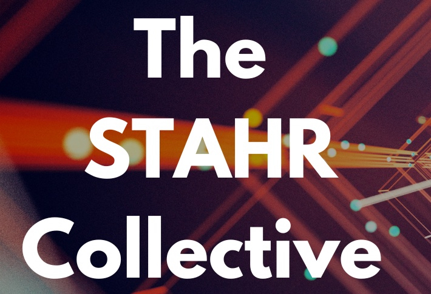
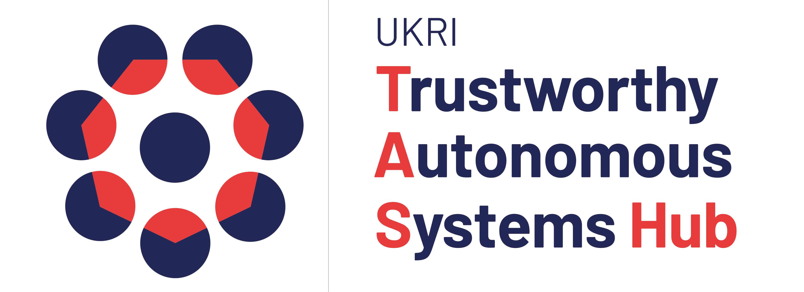

<!-- > **Update:** Submissions are now closed for the workshop. Conference attendees are welcome to register and participate in our workshop without making a submission, please register interest through the [conference website](https://cc.acm.org/2024/attend/#registration).   -->

# **About**
This third ACM C&C workshop on explainable AI for the Arts (XAIxArts) will bring together a community of researchers and creative practitioners in Human-Computer Interaction (HCI), Interaction Design, AI, explainable AI (XAI), and Digital Arts to explore the role of XAI for the Arts. XAI is a core concern of Human-Centred AI and relies heavily on HCI techniques to explore how to make complex and difficult to understand AI models more understandable to people. Our [first workshop](./2023) explored the landscape of XAIxArts and identified emergent themes, whilst the [second iteration](./2024) focused on co-developing a manifesto. 

This workshop will bring researchers together to expand the XAIxArts community; advance discussions on current and emerging XAIxArts practices and identify areas for intervention using speculative futures. The main themes will focus on:  
* Reducing Marginalisation by AI
* Adapting AI for Arts Practice
* Evaluating XAI for Arts 
* Mapping for Real-time Interaction
* AI to Spark Reflection

### Important Information   
* **Venue:** Online at the ACM Creativity and Cognition conference 2025  
* **Submission Deadline:** Thursday 24th April, 2025, 23:59 AoE 
* **Notifications:** Thursday 22nd May, 2025, 23:59 AoE
* **Workshop Date:**  Monday 23rd June, 2025
<!-- **Workshop Date:** TBC **Venue:**  Online.  -->

<!-- The workshop takes place at C&amp;C conference venue. Please check the [workshop room information](https://programs.sigchi.org/c&c/2024/program/content/158027).    -->

<!-- The MSTeams meeting link:  
[https://bit.ly/XAIxArts2MSTeams](https://bit.ly/XAIxArts2MSTeams)  
MSTeam Meeting ID: 317 831 307 774  
Passcode: NTWukk   -->

<!-- ### Important Information   
* **Venue:** Hybrid (Chicago, IL, USA and Online)    
* **Submission Deadline:** <del>Thursday, 2nd May, 2024</del>  
* **Notifications:** <del>Thursday 16th May, 2024</del>
* **Camera-Ready Submission:** <del>Thursday 6th June, 2024</del>   
* **Video Submission:** <del>Tuesday 18th June, 2024</del>   
* **Workshop Date:** Sunday, 23rd June, 2024  

**C&C Conference attendees are welcome to participate in the workshop** - please register interest through the [conference website](https://cc.acm.org/2024/attend/#registration) and contact the workshop organisers with any questions.   --> 

## **Themes**

This workshop will explore how XAI might be used in the Arts and how the Arts might contribute to new forms of XAI. It will examine the challenges and opportunities at the intersection of XAI and the Arts (XAIxArts), offering a fresh and critical view on the explainable aspects of Responsible AI and Human-Centred AI more broadly. The themes include **but are not limited to**:  

### Reducing Marginalisation by AI

Current AI models tend to prioritise certain views, experiences and perspectives. This raises critical questions about inclusion and exclusion in AI systems: Who is represented, and who is marginalised? Whose perspectives are privileged, and who holds power in shaping these models? How can we ensure equal accessibility across diverse user groups?  

Bias in artistic practice using AI is an often assumed inevitable consequence as a result of the dataset used. Datasets
are often the foundational material for artistic systems using AI. Artists and developers can take an active role in curating datasets that reflect a broad range of cultural, social, and aesthetic perspectives, where appropriate. This workshop seeks to examine whether insights from the Arts suggest more transparent and ethical processes for the creation of and adoption of AI, to subvert current practice, and ensure fairness in AI models and their use. Or, to explain the inherent biases of AI to mitigate its mismanagement?

### Adapting AI for Arts Practice

Across XAIxArts so far, opportunities have been identified for current AI tools to be pushed for creative endeavour and preserve artists’ agency in creative practices. For example, artists have navigated generative AI models to expose their bias or explored latent spaces by way of exposing its limits. These methods and techniques resonate with qualities of the creative user experience of surprise, ambiguity and reflection – often in opposition to the technocentric and functional goals of traditional XAI. However, there are still open questions on how to balance these techniques to offer both explainability and opportunity for surprise.

### Evaluating XAI for Arts 

Many existing methods for evaluating XAI models focus on issues such as accuracy or how helpful they are to productivity. This misses key qualities of the creative user experience. Existing HCI research methods also tend
to prioritise data collection across representative samples – at odds with creative practitioners who have a more individualised practice, or where explanations must be tailored on a case by case basis e.g. to an individual’s AI literacy or ability. Whether an AI system produces explanations conducive to an artist and their artistic identity is more open-ended and subjective, yet crucial to its meaningfulness in the arts. A system that does not align with an artist’s workflow and identity may undermine their agency, while one that supports their creative vision can become a useful tool for artistic exploration and expression. XAIxArts could help to develop ways of promoting research that accounts for first-person perspectives and explanations of AI art’s aesthetic, rather than more generalised approaches.

### Mapping for Real-time Interaction

Explaining AI models through interaction is complex in artistic domains. For example, explanation is often needed in-the-moment as people interact with AI in real-time settings, such as in jazz improvisation. This contrasts with post-hoc explanations more frequently used in broader XAI research. Mapping the interaction to the output of an AI system
in a way that is conducive to the creative process also poses open questions.  Through this theme, complexities of designing AI systems are highlighted that not only generate real-time explanations but also align with the fluid and embodied nature of artistic practice.

### AI to Spark Reflection

The Arts have an opportunity to be playful with AI, to expose inherent biases and imperfections of AI systems to audiences – turning potential flaws into opportunities for sparking reflection and creative expression.  There is potential for the Arts to suggest how to design playful AI explanations which could spark reflection, beyond current understandings in more productivity-focused domains. How to evaluate whether reflection on AI and its processes has occurred is an open-ended question.

# **Call for Participation**  

To participate in the workshop, please submit either A) a position paper, B) a short video, or C) a pictorial. Your submission should tell us about your XAI and/or Arts research and practice addressing the themes and open questions above. Submission requirements are:  

* **A) Position paper**\
Papers should be submitted to the [EasyChair](https://easychair.org/conferences?conf=xaixarts2025) as a PDF in the [ACM SIGCHI submission template format](https://www.acm.org/publications/proceedings-template) (SIGCHI ACM new, standardized single-column format, in LaTex use the command `\documentclass[manuscript,review]`) and a maximum of 4 pages in length. Note that Microsoft Word users should use the interim template.
  * Please include the workshop details in your submission (use the following LaTeX command in the preamble of your document: `\acmConference[XAIxArts 2024]{Explainable AI for the Arts Workshop 2024}{June 23, 2024}{Chicago, IL, United States}`).  
  * Papers do not need to be anonymised.  
  * Papers do not need to include the CCS codes.  
  * Papers do not need to include the submission date information.  

* **B) Short video**\
Upload your video (maximum 5 minutes, maximum file size 50MB) to a file transfer site such as WeTransfer and submit a PDF document to the [EasyChair](https://easychair.org/conferences?conf=xaixarts2025) stating that this is a video submission and providing the URL to download your video. Note that videos cannot be uploaded directly to the EasyChair system. Please ensure that the download link is valid until at least to June 24, 2024. Please complete all sections of the EasyChair submission system including providing a Title and Abstract to briefly describe the content of your video.

* **C) Pictorial**\
Pictorials should be submitted to [EasyChair](https://easychair.org/conferences?conf=xaixarts2025) using the C&C Pictorials templates (for [inDesign](https://www.dropbox.com/scl/fi/i3so7lro1e30pszznjns5/ACM_CC_Pictorials_inDesign_template_2024-Folder.zip?rlkey=rgt3e540325jt35i4h4ecguan&dl=0), [Word](https://www.dropbox.com/scl/fi/9xy15okrmuypmfpzy9pkq/ACMCC_2024_Pictorials_WORD_Template.docx?rlkey=os22ov5s5eutfs5yg4yv7j1by&dl=0) or [Powerpoint](https://www.dropbox.com/scl/fi/d9q65llbd68uyeh746byk/ACMCC_2024_Pictorials_PowerPoint_Template.pptx?rlkey=jsbt92t7x1t3v46twasvbq8mj&dl=0)), maximum 4 pages PDF. Maximum file size 50MB. Include the submission's title, author(s) and their affiliation(s), and a 150-word abstract on the first page. In keeping with C&C Pictorial submissions, additional written sections such as Introduction, Conclusion, Discussion, Acknowledgements, and References are *optional*. The submission should focus on an annotated visual composition and use the format creatively. Examples can be found on the [C&C 2024 website](https://cc.acm.org/2024/pictorials/). Please complete all sections of the EasyChair submission system, including a Title and Abstract.  

Participants will be selected based on the quality of their contribution to the debate about XAIxArts with a view to creating a balance of topics in the workshop. Accepted papers, pictorials, and videos will be shared with participants via the workshop website prior to the workshop, and the copyright is retained by the authors.  

At least one author of each accepted position paper must attend the workshop and that all participants must register for both the workshop and the ACM Creativity and Cognition 2025 conference.  

<!-- # **Proceedings** -->
<!-- Proceedings of the workshop are available at [https://arxiv.org/abs/2406.14485](https://arxiv.org/abs/2406.14485) -->
<!-- Proceedings of the workshop will be published after the conference. -->

<!-- # **Schedule**  -->

<!-- Schedule for the workshop will be published soon. -->

<!-- **Sunday, 23rd June, 2024   Workshop Schedule**  
All times are displayed in workshop time zone (Chicago, IL. UTC -05:00)   

**09:00**  Arrival   

**09:30**  Welcome and ice breaker (15 mins)

**09:45**  Presentations group A + Q&A (10 min each) (60 mins)

 * Gayatri Raman and Erin Brady. <i>Exploring Use and Perceptions of Generative AI Art Tools by Blind Artists</i>  <a href="https://xaixarts.github.io/accepted-2024/Raman-XAIxArts-2024-paper.pdf">[pdf]</a>        
 * Jie Fu, Shun Fu and Mick Grierson. <i>Coral Model Generation from Single Images for Virtual Reality Applications</i>  <a href="https://xaixarts.github.io/accepted-2024/Fu-XAIxArts-2024-paper.pdf">[pdf]</a> <a href="https://xaixarts.github.io/accepted-2024/videos/Fu-XAIxArts-2024-video.mp4">[video]</a>    
 * Jia-Rey Chang. <i>Loki Test</i> <a href="https://xaixarts.github.io/accepted-2024/Chang-XAIxArts-2024-paper.pdf">[pdf]</a> <a href="https://xaixarts.github.io/accepted-2024/videos/Chang-XAIxArts-2024-video.mp4">[video 1]</a> <a href="https://xaixarts.github.io/accepted-2024/videos/Chang-XAIxArts-2024-video-presentation.mp4">[video 2]</a>    
 * Makayla Lewis. <i>Looking Back, Moving Forward: A First-Person Perspective Of How Past Generative Artificial Intelligence Encounters Shape Today's Creative Practice</i>  <a href="https://xaixarts.github.io/accepted-2024/Lewis-XAIxArts-2024-paper.pdf">[pdf]</a>    
 * Terence Broad. <i>Using Generative AI as an Artistic Material: A Hacker’s Guide</i>  <a href="https://xaixarts.github.io/accepted-2024/Broad-XAIxArts-2024-paper.pdf">[pdf]</a> <a href="https://xaixarts.github.io/accepted-2024/videos/Broad-XAIxArts-2024-video.mp4">[video]</a>    

**10:45**  Coffee break (15 mins)  

**11:00**  Brainstorm about XAIxArts themes (30 mins)  

**11:30**  Co-develop XAIxArts manifesto (30 mins)  

**12:00**  Plans for network and community e.g. edited book (30 mins)  

**12:30**  Lunch (90 mins)  

**14:00**  Presentations group B + Q&A (10 min each) (60 mins)  

 * Shuoyang Zheng, Anna Xambó Sedó and Nick Bryan-Kinns. <i>A Mapping Strategy for Interacting with Latent Audio Synthesis Using Artistic Materials</i> <a href="https://xaixarts.github.io/accepted-2024/Zheng-XAIxArts-2024-paper.pdf">[pdf]</a> <a href="https://xaixarts.github.io/accepted-2024/videos/Zheng-XAIxArts-2024-video.mp4">[video]</a>    
 * Simon Hutchinson. <i>Artificial Neurons for Music and Sound Design</i> <a href="https://xaixarts.github.io/accepted-2024/Hutchinson-XAIxArts-2024-paper.pdf">[pdf]</a> <a href="https://xaixarts.github.io/accepted-2024/videos/Hutchinson-XAIxArts-2024-video.mp4">[video]</a>     
 * Elizabeth Wilson, Deva Scubert, Mika Satomi, Alex McLean and Juan Felipe Amaya Gonzalez. <i>Embodied Exploration of Latent Spaces and Explainable AI</i>  <a href="https://xaixarts.github.io/accepted-2024/Wilson-XAIxArts-2024-paper.pdf">[pdf]</a> <a href="https://xaixarts.github.io/accepted-2024/videos/Wilson-XAIxArts-2024-video.mp4">[video]</a>    
 * Austin Tecks, Thomas Peschlow and Gabriel Vigliensoni. <i>Explainability Paths for Sustained Artistic Practice with AI</i>  <a href="https://xaixarts.github.io/accepted-2024/Tecks-XAIxArts-2024-paper.pdf">[pdf]</a> <a href="https://xaixarts.github.io/accepted-2024/videos/Tecks-XAIxArts-2024-video.mp4">[video]</a>    
 * Jesse Allison, Drew Farrar, Treya Nash, Carlos G. Román, Morgan Weeks and Fiona Xue Ju. <i>Play Me Something “Icy”: Practical Challenges, Explainability and the Semantic Gap in Generative AI Music</i>  <a href="https://xaixarts.github.io/accepted-2024/Allison-XAIxArts-2024-paper.pdf">[pdf]</a> <a href="https://xaixarts.github.io/accepted-2024/videos/Allison-XAIxArts-2024-video.mp4">[video]</a>    
 * Nick Bryan-Kinns and Zijin Li. <i>Reducing Barriers to the Use of Marginalised Music Genres in AI</i>  <a href="https://xaixarts.github.io/accepted-2024/Bryan-Kinns-XAIxArts-2024-paper.pdf">[pdf]</a> <a href="https://xaixarts.github.io/accepted-2024/videos/Bryan-Kinns-XAIxArts-2024-video.mp4">[video]</a>    

**15:00**  Coffee break (15 mins)

**15:15**  Brainstorm about XAIxArts themes (15 mins)

**15:30**  Co-develop XAIxArts manifesto (15 mins)

**15:45**  Plans for network and community e.g. edited book (15 mins)

**16:00**  Close    -->

<!-- # **Call for Participation**  

**Submissions are now closed for the workshop. Conference attendees are welcome to register and participate in our workshop without making a submission.**

At least one author of each accepted position paper must attend the workshop and that all participants must register for both the workshop and the ACM Creativity and Cognition 2024 conference.  

To participate in the workshop, please submit either A) a position paper, B) a short video, or C) a pictorial. Your submission should tell us about your XAI and/or Arts research and practice addressing the themes and open questions on the workshop website. Submission requirements are:  

* **A) Position paper**\
Papers should be submitted to the [EasyChair](https://easychair.org/conferences/?conf=xaixarts2024) as a PDF in the [ACM SIGCHI submission template format](https://www.acm.org/publications/proceedings-template) (SIGCHI ACM new, standardized single-column format, in LaTex use the command `\documentclass[manuscript]`) and a maximum of 4 pages in length. Note that Microsoft Word users should use the interim template.
  * Please include the workshop details in your submission (use the following LaTeX command in the preamble of your document: `\acmConference[XAIxArts 2024]{Explainable AI for the Arts Workshop 2024}{June 23, 2024}{Chicago, IL, United States}`).  
  * Papers do not need to be anonymised.  
  * Papers do not need to include the CCS codes.  
  * Papers do not need to include the submission date information.  

* **B) Short video**\
Upload your video (maximum 5 minutes, maximum file size 50MB) to a file transfer site such as WeTransfer and submit a PDF document to the [EasyChair](https://easychair.org/conferences/?conf=xaixarts2024) stating that this is a video submission and providing the URL to download your video. Note that videos cannot be uploaded directly to the EasyChair system. Please ensure that the download link is valid until at least to June 24, 2024. Please complete all sections of the EasyChair submission system including providing a Title and Abstract to briefly describe the content of your video.

* **C) Pictorial**\
Pictorials should be submitted to [EasyChair](https://easychair.org/conferences/?conf=xaixarts2024) using the C&C 2024 Pictorials template (for [inDesign](https://www.dropbox.com/scl/fi/i3so7lro1e30pszznjns5/ACM_CC_Pictorials_inDesign_template_2024-Folder.zip?rlkey=rgt3e540325jt35i4h4ecguan&dl=0), [Word](https://www.dropbox.com/scl/fi/9xy15okrmuypmfpzy9pkq/ACMCC_2024_Pictorials_WORD_Template.docx?rlkey=os22ov5s5eutfs5yg4yv7j1by&dl=0) or [Powerpoint](https://www.dropbox.com/scl/fi/d9q65llbd68uyeh746byk/ACMCC_2024_Pictorials_PowerPoint_Template.pptx?rlkey=jsbt92t7x1t3v46twasvbq8mj&dl=0)), maximum 4 pages PDF. Maximum file size 50MB. Include the submission's title, author(s) and their affiliation(s), and a 150-word abstract on the first page. In keeping with C&C Pictorial submissions, additional written sections such as Introduction, Conclusion, Discussion, Acknowledgements, and References are *optional*. The submission should focus on an annotated visual composition and use the format creatively. Examples can be found on the [C&C 2024 website](https://cc.acm.org/2024/pictorials/). Please complete all sections of the EasyChair submission system, including a Title and Abstract.  

Participants will be selected based on the quality of their contribution to the debate about XAIxArts with a view to creating a balance of topics in the workshop. Accepted papers, pictorials, and videos will be shared with participants via the workshop website prior to the workshop, and the copyright is retained by the authors.  
 -->

# **Organizers**

* Corey Ford (Co-Chair), University of the Arts London, United Kingdom
* Elizabeth Wilson (Co-Chair), University of the Arts London, United Kingdom
* Nick Bryan-Kinns, University of the Arts London, United Kingdom  
* Shuoyang Zheng, Queen Mary University of London, United Kingdom  
* Gabriel Vigliensoni, Concordia University, Canada  
* Jeba Rezwana, Towson University, United States 
* Lanxi Xiao, Tsinghua University, China   
* Michael Clemens, University of Utah, United States  
* Makayla Lewis, Kingston University, United Kingdom 
* Drew Hemment, University of Edinburgh, United Kingdom  
* Alan Chamberlain, University of Nottingham, United Kingdom 
* Helen Kennedy, University of Nottingham, United Kingdom  
  

# **Acknowledgements**
<!-- We would like to acknowledge the support of the Engineering and Physical Sciences Research Council - [grant number EP/T022493/1] Horizon: Trusted Data-Driven Products, [grant number EP/Y009800/1] AI UK: Creating an International Ecosystem for Responsible AI Research and Innovation & [grant number EP/V00784X/1] UKRI Trustworthy Autonomous Systems Hub. -->

This work was supported by the Engineering and Physical Sciences Research Council through the Turing AI World Leading Researcher Fellowship in Somabotics: Creatively Embodying Artificial Intelligence [grant number APP22478],  AI UK: Creating an International Ecosystem for Responsible AI Research and Innovation [EP/Y009800/1] (RAI UK/RAKE) and the STAHR Collective https://www.stahrc.org

{:width="26%"}
{:width="26%"}
{:width="26%"}

<!-- 
{:width="32%"} {:width="40%"}{:width="26%"}  -->

# **Contacts**
If you have any questions feel free to contact Corey, Lizzie, Nick or Shuoyang at the following email addresses:

- c.j.ford@qmul.ac.uk  
- e.j.wilson@arts.ac.uk
- n.bryankinns@arts.ac.uk  
- shuoyang.zheng@qmul.ac.uk  

