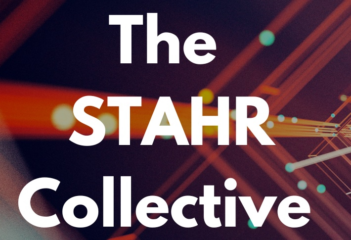

<!-- > **Update:** Submissions are now closed for the workshop. Conference attendees are welcome to register and participate in our workshop without making a submission, please register interest through the [conference website](https://cc.acm.org/2024/attend/#registration).   -->

# **About**
This 4th ACM C&C workshop on explainable AI for the Arts (XAIxArts) brings together and expands a community of researchers and creative practitioners in Human-Computer Interaction (HCI), Interaction Design, AI, eXplainable AI (XAI), and Digital Arts to explore the role of XAI for the Arts. XAI is a key concern of Responsible and Human-Centred AI, emphasising HCI techniques that make opaque AI models more understandable to people. XAIxArts offers a distinctive lens to examine explainability through creative and artistic domains. Our [previous workshops](./workshops) explored the landscape and the speculative futures of AI in creative processes. The 4th workshop focuses on the *operationalisation* of XAI in the Arts. The themes include but are not limited to:
 * Beyond XAI as Tools
 * XAI in Creativity Support
 * Practice-Based and Critical Views on XAI
 * Empowerment, Inclusion, and Fairness
 * Openness for XAI

### **Important Information**   
XAIxArts 2026 will be held at the ACM Creativity and Cognition Conference 2026
* **Submission Deadline:** Thursday 23rd April, 2026, 23:59 AoE
* **Notifications:** Thursday 14th May, 2026
* **Workshop Date:** Monday 13th July, 2026

**Venue:** In-person, London, UK. Hosted at [Central Saint Martins, University of the Arts London](https://cc.acm.org/2026/venue/).

<!-- **Workshop Date:** TBC **Venue:**  Online. 

<!-- The workshop takes place at C&amp;C conference venue. Please check the [workshop room information](https://programs.sigchi.org/c&c/2024/program/content/158027).    -->

<!-- The MSTeams meeting link:  
[https://bit.ly/XAIxArts2MSTeams](https://bit.ly/XAIxArts2MSTeams)  
MSTeam Meeting ID: 317 831 307 774  
Passcode: NTWukk   -->

<!-- ### Important Information   
* **Venue:** Hybrid (Chicago, IL, USA and Online)    
* **Submission Deadline:** <del>Thursday, 2nd May, 2024</del>  
* **Notifications:** <del>Thursday 16th May, 2024</del>
* **Camera-Ready Submission:** <del>Thursday 6th June, 2024</del>   
* **Video Submission:** <del>Tuesday 18th June, 2024</del>   
* **Workshop Date:** Sunday, 23rd June, 2024  

**C&C Conference attendees are welcome to participate in the workshop** - please register interest through the [conference website](https://cc.acm.org/2024/attend/#registration) and contact the workshop organisers with any questions.   --> 

## **Themes**

This workshop will explore how XAI might be used in the Arts and how the Arts might contribute to new forms of XAI. It will examine the challenges and opportunities at the intersection of XAI and the Arts (XAIxArts), offering a fresh and critical view on the explainable aspects of Responsible AI and Human-Centred AI more broadly. The themes include but are not limited to:

### **Beyond XAI as Tools**

An increasing number of works treat AI as truly autonomous actors with the capability of operating independently with minimal human intervention, pushing the boundary of the role of AI in the Arts beyond just an interface on top of a model, extending to self-organised, situated, and embodied creative apparatus. This brings XAIxArts with questions about how we might operationalise transparency and accountability given the complex environment of actors, creators, audience, materials, and creativity. We ask the following questions:

 - Given the agentic view in which AI has apparent autonomy, where does the creative agency reside? How does one interpret the artistic intent? Who is responsible for the explanation? The AI model, the artist, or the audience?
 - How should we think about explainability when an AI can act with movement, intimacy, and creative agency?
 - What would be the form of explanation beyond pixels or text, and beyond responding to why-questions?
 - How can ethical frameworks be proposed, tailored, and adapted to best accommodate the balance between AI and human agency in artistic practices?
 - What are our responsibilities when delegating work, labour, and practice to AIs?

### **XAI in Creativity Support**
We are seeing a flourishing landscape of HCI research on creativity support tools that integrate AI for content creation. New modes of artistic and creative practices have emerged to respond to the rapidly shifting creative AI capabilities. Meanwhile, the debate about AI in creativity support ranges from copyright, AI provenance, biases, and wider ethical considerations, posing open questions to the transparency and accountability of AI. We ask the following questions:
 - What kinds of explanations matter for XAI in creative tasks? What XAI techniques can help align on autonomy and agency in creative practices with AI?
 - How should explanations support different stages of creative work? How to tailor explanations to specific creative practices? Can new creative practices with XAI systems emerge?
 - What evaluation methods can capture creative success beyond accuracy and productivity, while remaining functional and comparable across studies?

### **Practice-Based and Critical Views on XAI**
Unlike traditional technocentric approaches to XAI, the arts provide an alternative lens that emphasises aesthetic, experiential, embodied, and critical inquiry, in order to develop alternative forms of explanation. This theme draws on the XAIxArts Manifesto to champion practice-based and critical perspectives that centre artistic processes and interdisciplinary collaboration. To expand what explainability can mean beyond technical transparency, we ask the following questions:
 - How can artist-led exploration of AI create works that explain and demystify AI through sound, visuals, and interaction?
 - How can artistic interventions that use AI as a material elucidate the functioning of AI through embracing failure, glitch and by repurposing these technologies beyond their original intended functioning?
 - How can we effectively host workshops, run residency programs, and curate exhibitions where artists are able to experiment freely with XAI?
 - How can artistic and critical practices interrogate the social and environmental costs of AI infrastructure and the data that underlies these models, while advocating for sustainable, low-resource approaches to XAI in the arts?

### **Empowerment, Inclusion, and Fairness**
Explainable AI (XAI) offers transparent, human-centred interaction with AI systems. In the arts, it can democratise creativity and amplify diverse voices, but technocentric designs risk exclusion, bias reinforcement, and prioritisation of efficiency over well-being. This theme centres empowerment, inclusion, and fairness as core to XAI in artistic practice. To further the call for approaches that further equity, agency, and ethical creativity, we ask the following questions:
 - What ethical guidelines can we co-create with artists that harness explainability to prevent harm, safeguard artistic integrity, secure fair attribution, and promote human creativity?
 - How can we meaningfully partner with underrepresented communities to incorporate their input on AI tools, datasets, and biases so that XAI truly reflects diverse needs and lived experiences?
 - How can we deliver training and compelling case studies that empower artists with the confidence, control, and critical understanding needed for transparent and ethical engagement with XAI?
 - How can we build XAI interfaces and tools that accommodate a wide range of technical literacies, sensory needs, and abilities?

### **Openness for XAI**
Openness in communities and resources enables research in XAI that is technically robust, inclusive, intuitive, and engaging for broad audiences. It enables a cross-disciplinary view from the Arts ensures that insights and innovation are accessible to those without technical expertise. The openness aspect in XAIxArts calls for open communities that promote a joint approach to AI and the Art, collaborations between artists, technologists, and practitioners from other disciplines. We ask the following questions:
 - What should be open in creative practices with AI? The code, models, datasets, prompts, or the creative intent, processes, or evaluations? What can or what must remain protected?
 - How can artists be included as co-researchers in XAI research, not just participants? What collaboration formats and strategies would effectively bridge the gaps between technical and artistic communities?
 - How to support initiatives that provide open access to datasets and models, with transparency around where the data was sourced from?
 - How to reach out to underrepresented artist groups to build inclusive communities around AI and the Arts?

# **Call for Participation**  

To participate in the workshop, please submit either (A) a paper, (B) a pictorial, or (C) a video. Your submission should tell us about your XAI and/or Arts research and practice addressing the themes and open questions above. Submission requirements are:  

* **(A) Paper**\
Papers should be submitted to the [EasyChair](https://easychair.org/my2/conference?conf=xaixarts2026) as a PDF in the [ACM SIGCHI submission template format](https://www.acm.org/publications/proceedings-template) (SIGCHI ACM new, standardized single-column format, in LaTeX use the command `\documentclass[manuscript,review]`) and a maximum of 4 pages in length. Note that Microsoft Word users should use the interim template.
  * Please include the workshop details in your submission (use the following LaTeX command in the preamble of your document: `\acmConference[XAIxArts 2026]{Explainable AI for the Arts Workshop 2026}{July 13, 2026}{London, UK}`).  
  * Papers do not need to be anonymised.  
  * Papers do not need to include the CCS codes.  
  * Papers do not need to include the submission date information.  
* **(B) Pictorial**\
Pictorials should be submitted to [EasyChair](https://easychair.org/my2/conference?conf=xaixarts2026) using the C&C Pictorials templates (for [inDesign](https://cc.acm.org/2026/wp-content/uploads/2025/10/ACM_CC_Pictorials_inDesign_template_2026.zip), [Word](https://cc.acm.org/2026/wp-content/uploads/2025/10/ACM_CC_2026_Pictorials_WORD_Template.docx) or [Powerpoint](https://cc.acm.org/2026/wp-content/uploads/2025/10/ACM_CC_2026_Pictorials_PowerPoint_Template.pptx)), maximum 4 pages PDF. Maximum file size 50MB. Include the submission's title, author(s) and their affiliation(s), and a 150-word abstract on the first page. In keeping with C&C Pictorial submissions, additional written sections such as Introduction, Conclusion, Discussion, Acknowledgements, and References are *optional*. The submission should focus on an annotated visual composition and use the format creatively. Examples can be found on the [C&C 2026 website](https://cc.acm.org/2026/pictorials/). Please complete all sections of the EasyChair submission system, including a Title and Abstract.  
* **(C) Video**\
Videos are equivalent to papers and pictorials in terms of production standards, archival qualities, and reviewing standards. The difference is the use of audio-visual components as the primary means of conveying information.
  * For submission, please upload your video (maximum 5 minutes, maximum file size 50MB) to a file transfer site such as WeTransfer. 
  * Please prepare a PDF document using the [ACM SIGCHI submission template format](https://www.acm.org/publications/proceedings-template) (SIGCHI ACM new, standardized single-column format, in LaTeX use the command `\documentclass[manuscript,review]`). In the document, please include the submission's title, author(s) and their affiliation(s), a 150-word abstract, and provide the URL to download your video. Please submit the PDF document to [EasyChair](https://easychair.org/my2/conference?conf=xaixarts2026). 
  * Note that videos cannot be uploaded directly to the EasyChair system. Please ensure that the download link is valid until at least July 13, 2026.

Submissions will be reviewed by the organising committee and selected based on the quality of their contribution to the debate of the workshop, with a view to creating a balance of topics. If your submission is accepted, these are the requirements for being included in the proceedings:

 * **A camera-ready paper, pictorial, or video** will be shared with participants via the workshop website prior to the workshop, and the copyright is retained by the authors.   
 * **A video presentation**. For paper and pictorial submissions, we require a video presentation up to 5 minutes in length for archiving purposes. It will be shared with participants via the workshop website prior to the workshop, and the copyright is retained by the authors. For video submission, the video presentation is optional.  
 * **At least one author of each accepted submission** must attend the workshop to present their work. All workshop attendees must register for both the workshop and the ACM Creativity and Cognition 2026 conference. Please visit the conference [registration page](https://cc.acm.org/2026/registration/) for more information.

### Lunchtime Demo
We welcome accepted authors to bring small-scale demos to share with other participants during the break time. However, we wouldn't be able to accommodate extra technical requirements. Therefore, if you would like to bring a lightweight demo to the workshop, please indicate its size and format in your submission. A demo is not a requirement for submission.

<!-- # **Proceedings**
Proceedings of the workshop are available at [https://arxiv.org/abs/2511.10482](https://arxiv.org/abs/2511.10482)  -->
<!-- Proceedings of the workshop will be published after the conference. -->
<!-- 
# **Schedule**  

Schedule for the workshop was as below.

All times are displayed in workshop time zone (London,  UK. UTC +1:00)   

**10:00**  Welcome and ice breaker (15 mins) 

**10:15**  Presentations Group A (10 mins per presentation)

 * Ziqing Xu and Nick Bryan-Kinns. <i>DeformTune: A Deformable XAI Music Prototype for Non-Musicians</i>  
  <a href="https://xaixarts.github.io/accepted-2025/Xu-DeformTune__A_Deformable_XAI_Music_Prototype_for_Non_Musicians.pdf">[pdf]</a>  <a href="https://xaixarts.github.io/accepted-2025/videos/DeformTune-Deformable-XAI-Music-Prototype-for-Non-musicians.mp4">[video] </a>     

 * Sonia Litwin. <i> Image of the Forest: Brain-Computer Interfaces and the Explainability of Interaction with Artificial Nature in XR (Pictoral)</i> 
 
 * Adam Cole and Mick Grierson. <i> Attention of a Kiss: Exploring Attention Maps in Video Diffusion for XAIxArts. </i> 
 <a href="https://xaixarts.github.io/accepted-2025/Cole-Exploring_Video_Diffusion_Transformer_Attention_Maps.pdf">[pdf]</a>

 * Catherine Mason. <i> Making Effective Decisions: Machine Learning and the Ecogame in 1970. </i>  
 <a href="https://xaixarts.github.io/accepted-2025/Mason-Making_ Effective_Decisions.pdf">[pdf]</a>  <a href="https://xaixarts.github.io/accepted-2025/videos/Mason-Making-Effective-Decisions.mp4">[video] </a>

 * Jia-Rey Chang. <i> Loki: Challenging AI Obedience Through Mischief and Humor</i> 
  <a href="https://xaixarts.github.io/accepted-2025/Loki_JiaReyChang_XAIxArts2025_update.pdf">[pdf]</a> <a href="https://xaixarts.github.io/accepted-2025/videos/JRChang_Loki_XAIxARTS25_VideoPresentation.mp4">[video]</a>    

**11:30**  Coffee break (15 mins)  

**11:45**  Speculative Futures: Planning (60 mins)  

**12:45**  Lunch (75 mins)  

**14:00**  Presentations group B + Q&A (10 min each) (60 mins)  

 *  Ricard Zhang and Duri Long. <i> Reflecting Through Strange AI. </i>
  <a href="https://xaixarts.github.io/accepted-2025/zhang-Reflecting_Through_strange_AI.pdf">[pdf]</a>

 * Ahmed M. Abuzuraiq and Philippe Pasquier. <i>Explainability-in-Action: Enabling Expressive Manipulation and Tacit Understanding by Bending Diffusion Models in ComfyUI </i> 
 <a href="https://xaixarts.github.io/accepted-2025/Abuzuraiq-Explainability_in_Action.pdf">[pdf]</a> <a href="https://xaixarts.github.io/accepted-2025/videos/Abuzuraiq-XAIxArts-2025-video.mkv">[video]</a>     

 * Vuong  Nguyen and Gabriel Vigliensoni. <i> fCrit: A Visual Explanation System for Furniture Design Creative Support </i> 
  <a href="https://xaixarts.github.io/accepted-2025/Nguyen-fCrit.pdf">[pdf]</a> <a href="https://xaixarts.github.io/accepted-2025/videos/Nguyen-fCrit-small.mp4">[video]</a> 

 * Jacqueline Bruen and Myounghoon  Jeon. <i> What's Behind the Magic? Audiences Seek Artistic Value in Generative AI's Contributions to a Live Dance Performance </i> 
  <a href="https://xaixarts.github.io/accepted-2025/Bruen-What’s Behind the Magic.pdf">[pdf]</a> <a href="https://xaixarts.github.io/accepted-2025/videos/Bruen.mp4">[video]</a>

 * Samuel Rhys Cox, Helena Bøjer Djernæs and Niels van Berkel. <i> Reflecting Human Values in XAI: Emotional and Reflective Benefits in Creativity Support Tools </i> 
  <a href="https://xaixarts.github.io/accepted-2025/Cox-Reflecting_Human_Values.pdf">[pdf]</a> <a href="https://xaixarts.github.io/accepted-2025/videos/COX-CC-Workshop-CutEdit.mp4">[video]</a>    

**15:15**  Coffee break (15 mins)

**15:30**  Speculative Futures Presenting (30 mins)

**16:00**  Plans for network and community (30 mins)

**16:30**  Final Notes and Closing    -->

# **Organizers**

 * Shuoyang Jasper Zheng (Co-Chair), Queen Mary University of London, United Kingdom  
 * Terence Broad (Co-Chair), University of the Arts London, United Kingdom  
 * Elizabeth Wilson, University of the Arts London, United Kingdom  
 * Adam Cole, University of the Arts London, United Kingdom  
 * Ziqing Xu, University of the Arts London, United Kingdom  
 * Jia-Rey Chang, Queen’s University Belfast, United Kingdom  
 * Gabriel Vigliensoni, Concordia University, Canada  
 * Jeba Rezwana, Towson University, USA  
 * Lanxi Xiao, Tsinghua University, China  
 * Michael Clemens, Independent Researcher, USA  
 * Makayla Lewis, Kingston University, United Kingdom  
 * Alan Chamberlain, University of Nottingham, United Kingdom  
 * Helen Kennedy, University of Nottingham, United Kingdom  
 * Corey Ford, University of the Arts London, United Kingdom  
 * Nick Bryan-Kinns, University of the Arts London, United Kingdom  

# **Acknowledgements**

This work was supported by the Engineering and Physical Sciences Research Council through the Turing AI World Leading Researcher Fellowship in Somabotics: Creatively Embodying Artificial Intelligence [grant number APP22478],  AI UK: Creating an International Ecosystem for Responsible AI Research and Innovation [EP/Y009800/1] (RAI UK/RAKE) and the STAHR Collective https://www.stahrc.org

{:width="26%"}
{:width="26%"}
{:width="26%"}

# **Contacts**
If you have any questions feel free to contact Shuoyang Zheng, Terence Broad, and Nick Bryan-Kinns at the following email addresses:

- shuoyang.zheng@qmul.ac.uk  
- t.broad@arts.ac.uk  
- n.bryankinns@arts.ac.uk  
