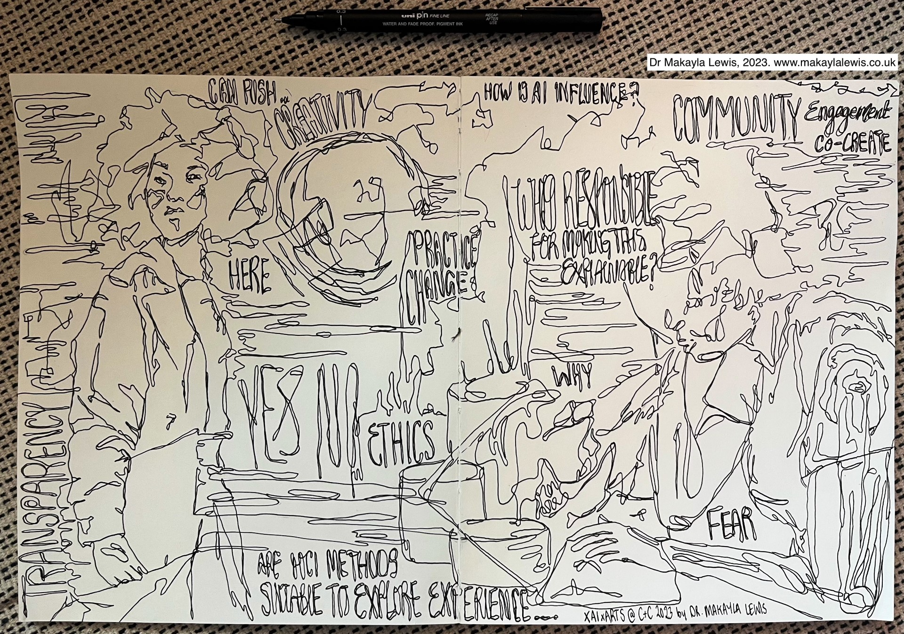

# Upcoming Workshop
[XAIxArts 2024](./2024) will be held in a hybrid mode in Chicago, IL, USA and online Sunday, June 23, 2024.

# Past Workshops  
Our first workshop brought together 14 accepted submissions to explore the landscape of XAIxArts and identify emergent themes to help frame XAIxArts.

* [XAIxArts 2023](./2023) [[Proceedings](https://arxiv.org/abs/2310.06428)]  

### Archived Workshop Descriptions  
* Nick Bryan-Kinns, Corey Ford, Alan Chamberlain, Steven David Benford, Helen Kennedy, Zijin Li, Wu Qiong, Gus G. Xia, and Jeba Rezwana. 2023. Explainable AI for the Arts: XAIxArts. In Proceedings of the 15th Conference on Creativity and Cognition (C&C ‘23). Association for Computing Machinery, New York, NY, USA, 1–7. [https://doi.org/10.1145/3591196.3593517](https://doi.org/10.1145/3591196.3593517)

### Visual Reflection from the First Workshop  

{:width="100%"}
Attribution: Dr Makayla Lewis, 2023. All Rights Reserved. Website: [www.makaylalewis.co.uk](https://makaylalewis.co.uk/)

