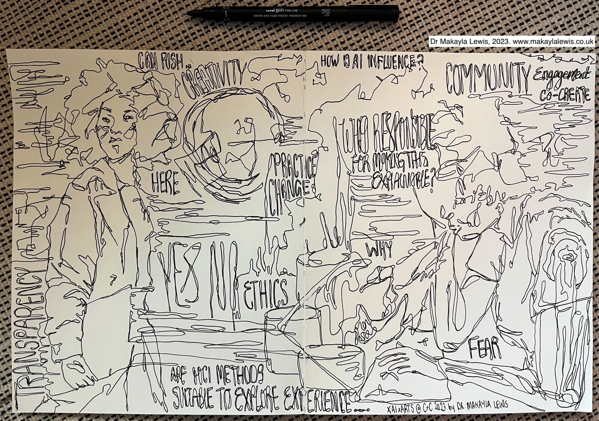
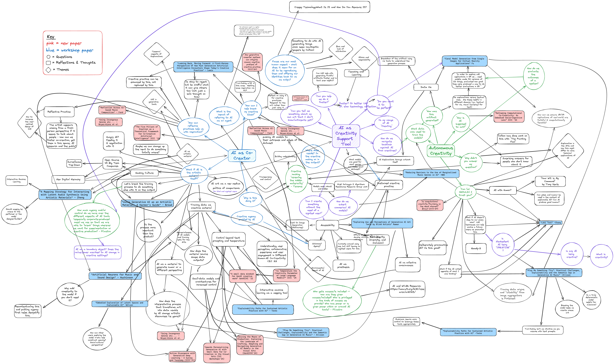

The international workshop series on explainable AI for the Arts (XAIxArts) brings together a community of researchers and creative practitioners in Human-Computer Interaction (HCI), Interaction Design, AI, explainable AI (XAI), and Digital Arts to explore the role of XAI for the Arts.

# Past Workshops  
Our first workshop in 2023 was held online and brought together 14 accepted submissions to explore the landscape of XAIxArts and identify emergent themes to help frame XAIxArts.

* [XAIxArts 2023](./2023) [[Proceedings](https://arxiv.org/abs/2310.06428)]  

Our second workshop in 2024 was held Chicago, IL, USA, and brought together 11 accepted submissions to expand our community exploring XAIxArts.

* [XAIxArts 2024](./2024) [[Proceedings](https://arxiv.org/abs/2406.14485)]

### Archived Workshop Descriptions  
* Nick Bryan-Kinns, Corey Ford, Alan Chamberlain, Steven David Benford, Helen Kennedy, Zijin Li, Wu Qiong, Gus G. Xia, and Jeba Rezwana. 2023. Explainable AI for the Arts: XAIxArts. In Proceedings of the 15th Conference on Creativity and Cognition (C&C ‘23). Association for Computing Machinery, New York, NY, USA, 1–7. [https://doi.org/10.1145/3591196.3593517](https://doi.org/10.1145/3591196.3593517)

* Nick Bryan-Kinns, Corey Ford, Shuoyang Zheng, Helen Kennedy, Alan Chamberlain, Makayla Lewis, Drew Hemment, Zijin Li, Qiong Wu, Lanxi Xiao, Gus Xia, Jeba Rezwana, Michael Clemens, and Gabriel Vigliensoni. 2024. Explainable AI for the Arts 2 (XAIxArts2). In Proceedings of the 16th Conference on Creativity & Cognition (C&C '24). Association for Computing Machinery, New York, NY, USA, 86–92. [https://doi.org/10.1145/3635636.3660763](https://doi.org/10.1145/3635636.3660763)

### Visual Reflection from the First Workshop in 2023

{:width="100%"}
Attribution: Dr Makayla Lewis, 2023. All Rights Reserved. Website: [www.makaylalewis.co.uk](https://makaylalewis.co.uk/)

### Co-Created Mindmap from the Second Workshop in 2024  

Co-created mindmap from the second workshop exploring the themes that lead to the creation of the XAIxArts Manifesto.

